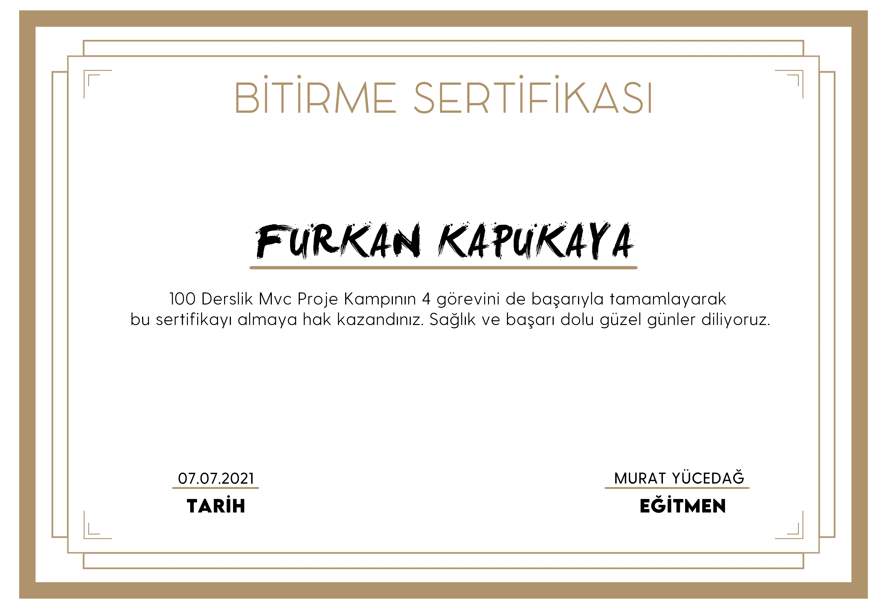

# MVC Project Camp
This project is being developed in parallel with Murat Yücedağ's "Mvc Project Camp" topics.  
To Join the Camp [Click Here](https://www.youtube.com/playlist?list=PLKnjBHu2xXNNQJehhCg--CzQQMHXTsFAb)  
For Mvc Project Camp Introduction and Q&A Broadcast [Click Here](https://youtu.be/dgRjNDipuWk)  
For Camp Discord Server(Help & Support) [Click Here](https://discord.gg/bFyd5VUEud)  

# Project Progress
### Lessons 1-20
   - Giriş yapıldı ve proje oluşturuldu.
   - View, Controller ve Layout kavramları üzerinde duruldu.
   - Katmanların oluşturuldu.
   - Entity katmanı sınıfları oluşturuldu.
   - Category, About ve Contact sınıfları oluşturuldu.
   - Tablolar rasında ilişkiler oluşturuldu.
   - Key ve StringLength Attributeleri üzerinde duruldu.
   - Context sınıfı oluşturuldu.
   - Webconfig yapılandırması ve bağlantı ayarları yapıldı.
   - Migration işlemleri tamamlandı ve veritabanı oluşturuldu.
   - Add Migration işlemi tamamlandı.
   - SQL üzerinde örnek veri girişleri yapıldı.
   - Abstract ve Interface bileşenleri oluşturuldu.
   - Repository sınıfı oluşturuldu ve metotların içi dolduruldu.
   - Generic Interface kavramı üzerinde duruldu.
   - Generic Repository kavramı üzerinde duruldu.
   - BusinessLayer katmanı üzerinde çalışma yapıldı.
   - Tablo kullanımı çalışmaları yapıldı.
### Lessons 21-24
   - Bootstrap kavramı üzerinde çalışmalar yapıldı.
   - Kategorilerin listelenmesi yapıldı.
   - Breakpoint kavramı hakkında bilgi verildi.
   - Kategori ekleme işlemine giriş yapıldı.
### Lessons 25-28
   - HttpGet ve HttpPost attributeleri hakkında bilgi verildi.
   - Kategori ekleme hataları ve verilmesi gereken hata mesajları konusundan bahsedildi.
   - Business Layer katmanında Abstract ve Interface olarak ICategoryService kavramları gösterildi.
   - Constructor Business Metot oluşturuldu.
### Lessons 29-32
   - DataAccessLayer katmanında entity framework sınıfları oluşturuldu.
   - Fluent Validation kavramına giriş yapıldı ve ilgili bileşenler kuruldu.
   - Validasyon işlemlerinden bahsedildi.
   - Html helper kapsamında "ValidationMessageFor" kullanımı gösterildi ve hata mesajları ilgili yerlerde gösterildi.
### Lessons 33-36
   - Seçilen Admin panel teması indirilerek yüklendi.
   - Tema üzerinde temel düzenlemeler yapılarak css, js ve image bağlantıları düzeltildi.
   - Sol (sidebar) menü kısmında düzenleme ve Türkçeleştirme çalışmaları yapıldı.
   - Sidebar kullanılarak kategorilerin listelenmesi ve yeni kategori ekleme çalışmaları yapıldı.
### Lessons 37-40
   - Kategori silme işlemi için kategorinin buldurulması için GetByID kavramı gösterildi.
   - Kategori silme işlemi gerçekleştirildi.
   - Kategori güncelleme işlemi için güncellenecek kategori bilgilerinin güncelleme sayfasına taşınması işlemleri yapıldı.
   - Kategori güncelleme işlemine giriş yapıldı.
### Lessons 41-44
   - Entity State komutları ile ekleme, güncelleme ve silme yapıları düzenlendi.  
   - Yazar listeleme, ekleme, güncelleme ve silme yapıları yapıldı.
   - Yazar profilleri listesi sayfası ayarlandı.
   - Add migration işlemi ile database güncellendi ve yazar ekleme sayfası yapıldı.
### Lessons 45-48
   - Yazar düzenleme metotdu ve sayfası eklendi.
   - ValidationMessage yazıları kırmızı yapıldı.
   - WriterTitle migration ile veri tabanına eklendi ve Yazar sayfasına entergre edildi.
   - IHeadingService,Heading Manager ve HeadingController oluşturuldu.
   - Başlık listeleme sayfası oluşturuldu.
   - Yeni başlık girişi işlemleri yapıldı.
   - Başlık işlemlerinde DropDownList ve ilişki yapıldı.
   - Başlık ekleme sayfasına DropDownList entegresi yapıldı.
   - Menülere link verildi.
### Lessons 49-52
   - Başlık sayfasına tema eklendi.
   - Tema Türkçeleştirildi ve veriler entegre edildi.
   - Kategoriler renklendirildi.
   - Yazar resim boyutu arttırıldı.
   - Yazarlara resimler eklendi.
   - Başlık tarihi düzenlendi.
   - WriterStatus eklendi.
   - ContentByHeading Sayfası ekledi ve tema eklendi
   - Content Service ve Managerler eklendi.
   - İçerikleri getiren GetListByID metotu yazıldı.
### Lessons 53-56
   - ContentByHeading sayfası enteglereleri yapıldı.
   - ContentByHeading sayfasında başlıklara dair içerikler getirildi.
   - ContentStatus eklendi.
   - Başlık isim ve kategori düzenleme işlemleri yapıldı.
   - Başlıkların aktif pasif özellikleri yapıldı.
   - Hakkımızda sayfası yapıldı ve popup eklendi.
### Lessons 57-60
   - Hakkımda sayfası işlemleri bitirildi.
   - Mesajlar sayfası yapıldı. Tema entegre edildi.
   - Mesajların listelenmesi yapıldı.
   - Mesajların detaylarının görülmesi yapıldı.
### Lessons 61-64
   - Mesajlar sınıfı işlemleri yapıldı.
   - Mesaj Controller ve Admin mesaj işlemleri yapıldı.
   - Yeni mesaj gönderme sayfası yapıldı.
   - Yeni mesaj gönderme sayfası işlemleri bitirildi.
### Lessons 65-68
   - Mesaj sayfası revizeleri yapıldı.
   - Mesaj sayfası işlemleri tamamlandı.
   - 404 Hata sayfasu yapıldı.
   - Galeri yapıldı.
### Lessons 69-72
   - Admin login sayfası eklendi, tema eklendi
   - Admin login işlemleri yapıldı.
   - Authentication ve Session işlemleri yapıldı.
   - Rolleme işlemleri yapıldı.
### Lessons 73-76
   - Yazar layout oluşturuldu.
   - Yazar başlık işlemleri yapıldı.
   - Yazar mesaj işlemleri yapıldı.
   - Yazarın yazığı yazılar gösterildi.
### Lessons 77-80
   - Writer giriş işlemleri yapıldı.
   - Writer girişe recaptcha eklendi.
   - Session ile bilgi taşıma işlemi yapıldı.
   - Session Allow Anonymous ile yetki-görüntüleme ayarlandı.
   - Oturum başlık yönetimi yapıldı.
### Lessons 81-84
   - Vitrin sayfası yapıldı
   - Vitrin sayfasında tüm başlıklar listelendi.
   - Başlıklara göre yazılar listelendi.
   - Yeni yazı girişi eklendi.
### Lessons 85-88
   - Paging ve sayfalama işlemi yapıldı.
   - Mesajlarda session yönetimi ayalarlandı.
   - Yazar profil sayfası yapıldı.
   - Yazr giriş işlemleri mimariye taşındı.
### Lessons 89-92
   - Vitrin eklendi.
   - Vitrin düzenlemeleri yapıldı.
   - Yazılarda arama işlemleri yapıldı.
### Lessons 93-96
   - IFrame eklendi.
   - Yazar görselleri düzeltildi.
   - Google chartlar eklendi.
   - Raporlama sayfası oluşturuldu.
   - Yetkilendirme düzenlemelerinin ilk kısmı yapıldı.
### Lessons 97-99
   - Yetkilendirme düzenlemelerinin son kısmı yapıldı.
   - Proje publish işlemi ve projenin canlıya taşınması işlemleri yapıldı.
   -Veri tabanının canlıya taşınması Ve backup işlemi yapıldı.
### Lessons 100
   Lesson 100 **Final** For Live Stream [Click Here](https://youtu.be/2FV6SRyL7U0)
### Camp Completed
#### [Detailed Video of the Project](https://youtu.be/44ZLJxbF0Yo)  

